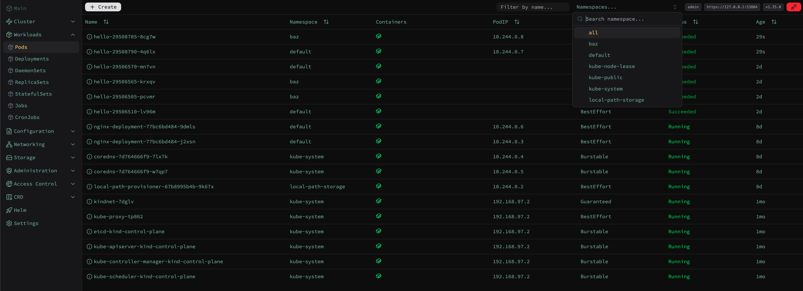
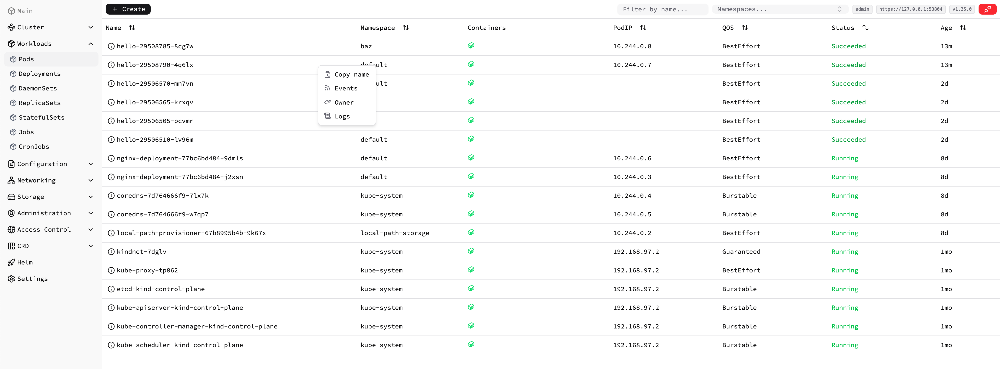

<h2 align="center">
    <code>teleskopio</code> is an open-source small and beautiful Kubernetes web client.
</h2>

    

### Preview

    

    

### Readme

[teleskopio.github.io](https://teleskopio.github.io)
