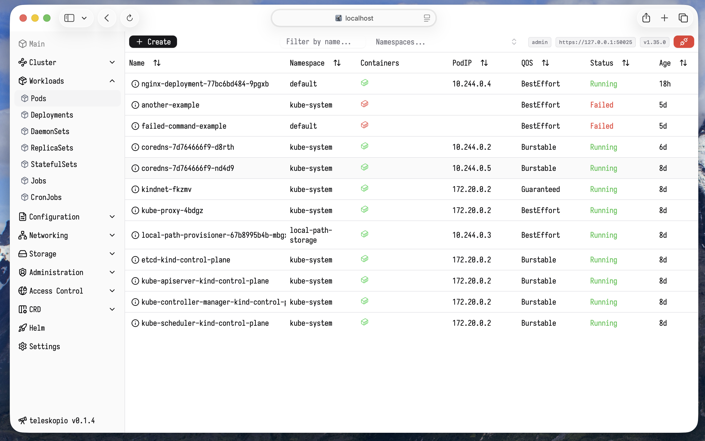
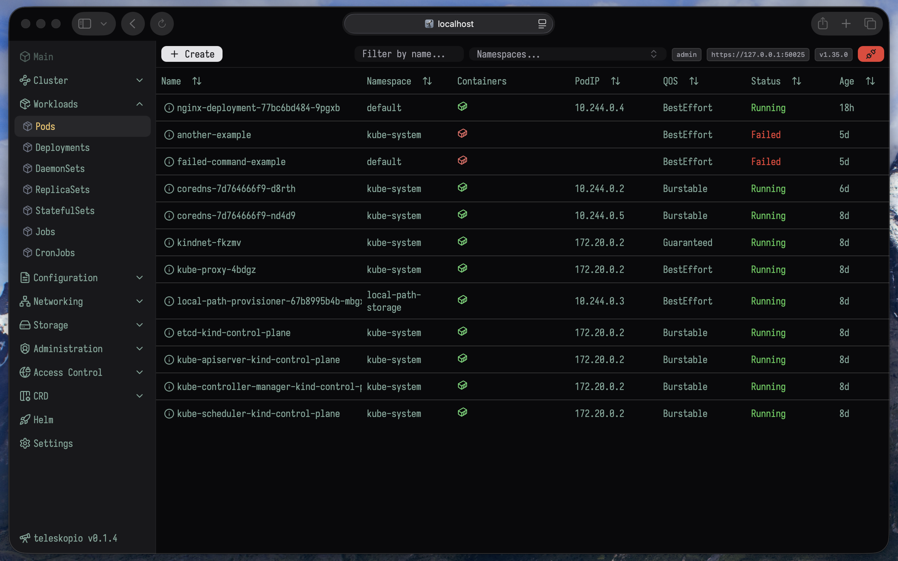

<p>
	<div align="center">
		<a href="https://teleskopio.github.io">
			
		</a>
	</div>
	<div align="center">
	  <p><a href="https://teleskopio.github.io">teleskopio</a> lightweight kubernetes web client.</p>
	</div>
</p>

<div aligh="center">
	
	
</div>

## Features

- Multiple config support – respect `$KUBECONFIG` variable and checks the `config.yaml` file.
- Simple `JWT` token authorization, admin and viewer role - Full access (admin) or Read Only access (viewer) to cluster.
- [Resource editor/creator](https://teleskopio.github.io/howtos/teleskopio-with-kind/#deploy-a-pod-2) - integrated [Monaco Editor](https://microsoft.github.io/monaco-editor/) with syntax highlighting.
- Live updates - real-time resource changes with `Kubernetes` watchers.
- `Pod` logs and `Event`'s - inspect logs and event history directly in the UI, owner links, share link to resource.
- [Light and dark themes](https://teleskopio.github.io/howtos/teleskopio-with-kind/#theme-and-font-2) and fonts.
- [Scale resources](https://teleskopio.github.io/howtos/teleskopio-with-kind/#scale-resources-2) `Deployments`, `ReplicaSets`
- Shortcuts to filter `CTRL + F` any resource,  jump to section `CTRL + J` any menu.
- [Objects multi-select operations](https://teleskopio.github.io/howtos/teleskopio-with-kind/#multiselect-2) (delete, drain, cordon, e.t.c.)
- [`go-client`](https://github.com/kubernetes/client-go) - based native implementation that interacts directly with the Kubernetes API server, no pulling, only websocket events.
- Kubernetes [resource schemas](https://github.com/yannh/kubernetes-json-schema?tab=readme-ov-file#kubernetes-json-schemas) per API version.
- [Helm integration](https://teleskopio.github.io/howtos/teleskopio-helm-integration).
- Zero dependencies, no need to install `kubectl`, `helm` on the host.
- Air-gapped environments ready. No external requests.
- Built-in [MCP server](https://teleskopio.github.io/howtos/mcp-server)

## Install

#### Linux

Download [release](https://github.com/teleskopio/teleskopio/releases).

#### MacOS

Use brew (ARM and Intel):

1. `brew tap teleskopio/homebrew-teleskopio`
1. `brew install --cask teleskopio`

#### Docker

1. Pull docker image from [Packages](https://github.com/teleskopio/teleskopio/pkgs/container/teleskopio)

```sh
docker pull ghcr.io/teleskopio/teleskopio:latest
```

2. Generate config

```sh
docker run -it --rm ghcr.io/teleskopio/teleskopio:latest config > config.yaml
```

3. Edit config, generate user passwords, add kube configs

```sh
$ htpasswd -nbB admin MySecret123 # apache2-utils
> admin:$2y$05$U7puDu7wKOMP6i4eI1nO4ux909bH8FuPadEQq2oxx7SRXrBh3xJIG
vim config.yaml # edit confAig and add admin user
# add kubeconfig content to kube.configs
# check example in config.yaml
```

4. Run

Run with `--network=host` if you're using kind cluster

```bash
docker run -it --rm --network=host -p 3080:3080 \
  -v $(pwd)/config.yaml:/usr/bin/config.yaml ghcr.io/teleskopio/teleskopio:latest \
  --config=/usr/bin/config.yaml
```

Or run with docker network

```bash
docker run -it --rm -p 3080:3080 \
  -v $(pwd)/config.yaml:/usr/bin/config.yaml ghcr.io/teleskopio/teleskopio:latest \
  --config=/usr/bin/config.yaml
5:47AM INF set loglevel level=DEBUG
5:47AM INF version version=""
5:47AM INF initialize web server addr=:3080
...
```

#### Helm

Right now only building `helm` package from sources install option available.

[Clone repository](https://github.com/teleskopio/teleskopio). Run `make build-helm-chart` (`helm` binary in `PATH` is required.)

Check out `helm` chart  [`values.yaml`](https://github.com/teleskopio/teleskopio/blob/master/deploy/teleskopio/values.yaml).

By default `RBAC's` for `teleskopio` give access to **all cluster and to any kind of operation**.

```bash
$ git clone git@github.com:teleskopio/teleskopio.git
$ cd teleskopio
$ make build-helm-char
helm package ./deploy/teleskopio
Successfully packaged chart and saved it to: /home/dev/teleskopio/teleskopio-0.1.4.tgz
# Add you own config.yaml
$ cat config.yaml
service:
  type: ClusterIP
  port: 3090

config:
  name: config
  content:
    log_color: false
    log_json: true
    log_level: INFO
    server_http: ":3090"
    jwt_key: "b2436e01424c714e4583f2f2851a0e1304440157" # openssl rand -hex 20
    auth_disabled: false
    users:
      - username: admin
        password: "$2y$05$PgEhSAwkE0RlbYiJqSxF/e529Xu5HGey.cEY/qqoksLlFckk3kaiW" # htpasswd -nbB admin MySecret123
        role: "admin"
      - username: user
        password: "$2y$05$PgEhSAwkE0RlbYiJqSxF/e529Xu5HGey.cEY/qqoksLlFckk3kaiW"
        role: "viewer"
    kube:
      configs:
# Install local helm chart with own values.yaml
$ helm install teleskopio ./teleskopio-0.1.4.tgz -f values.yaml
NAME: teleskopio
LAST DEPLOYED: Sun Feb  1 15:39:52 2026
NAMESPACE: default
STATUS: deployed
REVISION: 1
DESCRIPTION: Install complete
NOTES:
1. Get the application URL by running these commands:
  export POD_NAME=$(kubectl get pods --namespace default -l "app.kubernetes.io/name=teleskopio,app.kubernetes.io/instance=teleskopio" -o jsonpath="{.items[0].metadata.name}")
  export CONTAINER_PORT=$(kubectl get pod --namespace default $POD_NAME -o jsonpath="{.spec.containers[0].ports[0].containerPort}")
  echo "Visit http://127.0.0.1:8080 to use your application"
  kubectl --namespace default port-forward $POD_NAME 8080:$CONTAINER_PORT

# Follow NOTES instruction and use port-forward
$ kubectl --namespace default port-forward $POD_NAME 8080:$CONTAINER_PORT
Forwarding from 127.0.0.1:8080 -> 3090
Forwarding from [::1]:8080 -> 3090
```

Open [http://127.0.0.1:8080](http://127.0.0.1:8080).

## Configuration

[config.example](pkg/config/config.TEMPLATE.yaml)
